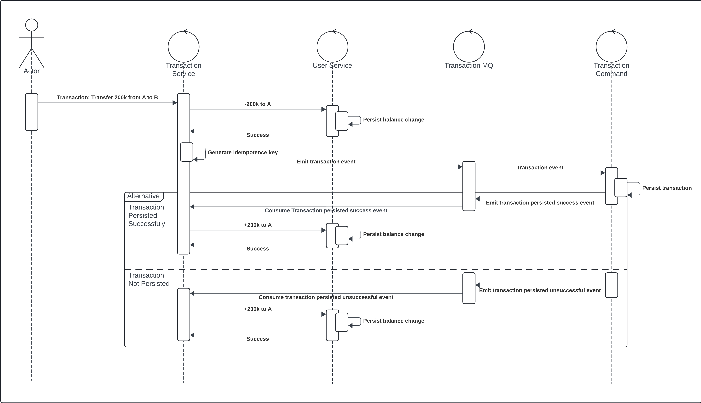

# distributed-payment-service


## About The Project
The project is trying to create robust payment/money disbursment system, employing the distributed system architecture.
### Study case:
_"The user has a balance in the application wallet and the balance wants to be disbursed"._
### Proposed solution:
#### Architecture: 
  <a>
    
  </a>
   
__Saga Pattern__:
The saga pattern facilitates non-blocking transactions by employing a commit-first approach. In the event of a failure, compensating transactions are executed to revert the system to a consistent state. 

__CQRS__:
CQRS (Command Query Responsibility Segregation) allows for optimized handling of read and write requests, as they often have differing traffic patterns, also facilitates separation of concerns within the system architecture.

__RESTful__: 
RESTful architecture offers fine-grained control compared to GraphQL, providing enhance:d security measures.

#### Tech-stack: 
__MongoDB__:
* Read-write optimized for availability
* Tradeoff: eventual consistency

__PostgreSQL__:
* Strong consistency via MVCC
* In our case, high concurrency with tuple lock using index

__Kafka__:
* AP message queue, functions as a persistent transport layer
* Pull-based, aligns naturally with worker-dispatcher architecture
* Can also be a change log service of the database
* Supports multiple service subscriptions, e.g., for fraud detection

__Redis__:
* Acts as a cache

#### Purpose of Each Service: 
__user-service__:
Acts as the main source of truth for user balances.
__transaction-service__:
Provides an interface/abstraction for accessing transaction commands and queries.
Acts as a dispatcher of database change events to be processed by the worker
Can also serve as the backend-for-frontend (BFF) layer for transaction queries if needed.
__transaction-command-service__:
Handles transaction command requests (e.g., update, delete, insert) as a worker, processing changes to the database.
__transaction-query-service__:
Acts as a worker for transaction queries, handling requests to retrieve transaction information.


### System In Action
  Here is the sequence diagram of the main use case, that is disbursment of the money from user A to user B.
  <a>
    
  </a>


## Getting Started

### Prerequisites
To run the projects, ensure that you have Docker installed in your PC.

### Installation
1. Clone the repo
   ```sh
   git clone https://github.com/egijago/distributed-payment-service.git
   ```
2. Navigate to the cloned repository in you local device
3. Setup the .env file for each service, following the .env.example. The provided .env.example example already works well with the docker-compose. 
3. Run all the service using docker compose 
   ```sh
   docker compose up
   ```

### Usage
Please refer to each presentation layer of each service: 
* user-service: [express routes](https://github.com/egijago/distributed-payment-service\tree\main\user-service\src\presentation\express.ts)
* transaction-service: [express routes](https://github.com/egijago/distributed-payment-service\tree\main\transaction-service\src\router.ts)
* transaction-command-service: [express routes](https://github.com/egijago/distributed-payment-service\tree\main\transaction-command-service\src\presentation\express.ts)
* transaction-query-service: [express routes](https://github.com/egijago/distributed-payment-service\tree\main\transaction-query-service\src\presentation\express.ts)

## Acknowledgments
* [Readme template](https://github.com/othneildrew/Best-README-Template/tree/master)


